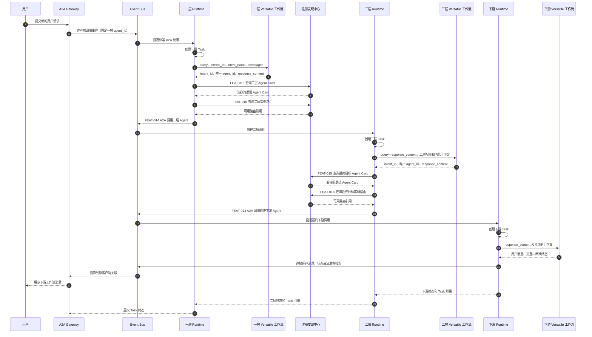
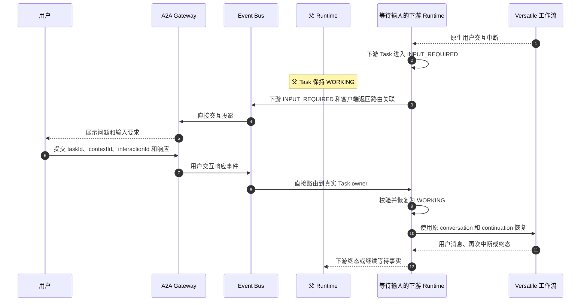
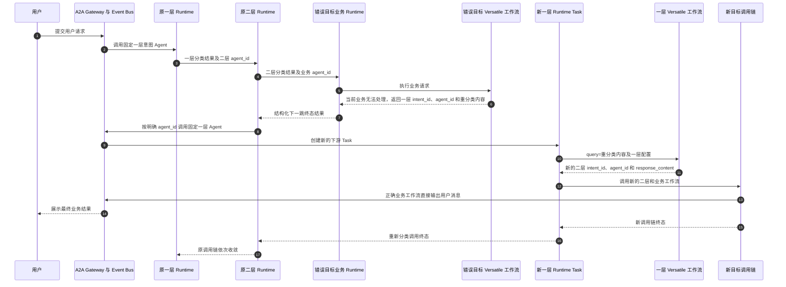

# 意图识别与多智能体协同短期方案 PRD

## 1. 背景与目标

### 1.1 背景

客户当前使用 Versatile 低码工作流实现意图识别。意图识别采用两层独立工作流：一层意图识别工作流先确定用户请求所属的大业务领域，再由对应的二层意图识别工作流确定需要执行的具体业务、澄清或未匹配处理工作流。

一层、二层和最终下游低码工作流均作为独立 Agent Service 部署：每个工作流由独立 `agent-runtime` 通过 Versatile Adapter 接入，通过标准 A2A 服务入口提供调用，并以标准 Agent Card 注册到 registry-discovery-center。新的用户请求通过 A2A Gateway 和消息总线进入固定的一层意图识别 Agent。

当前 Versatile 意图识别工作流可以返回低码平台生成的 `intent_id`，但该标识不能直接作为平台 Agent Card 的逻辑身份使用。客户需要改造一层、二层意图识别工作流，在每次正常识别结果中同时返回与 registry-discovery-center 逻辑 Agent Card 对应的唯一 `agent_id`。Agent Runtime 据此完成下一跳 Agent Card 查询、运行实例路由和标准 A2A 调用。

客户明确要求：当最终业务工作流判断一层、二层分类结果与用户真实诉求不符、当前工作流无法处理时，能够返回固定的一层意图 Agent 重新分类。该过程属于业务工作流显式发起的正常结构化交接，不属于技术失败或用户交互中断。

本 PRD 描述该短期方案所需的 Agent Runtime 能力、客户接入条件、两层调用链、分类错误后的重新分类、消息总线直接用户交互、Task 关系、失败与验收要求。

### 1.2 需求名称与模块归属

| 项目 | 内容 |
|---|---|
| 需求名称 | 支持 Versatile 意图工作流适配兼容 |
| PRD 名称 | 意图识别与多智能体协同短期方案 PRD |
| 模块归属 | Agent Runtime |

### 1.3 目标

1. 在 FEAT-002 通用 Versatile REST/SSE 代理能力上提供统一的 Versatile 意图工作流适配能力，并由同一个 Adapter 实现分别接入一层、二层意图识别工作流。
2. 使用统一输入契约调用当前意图识别工作流，并从正常结果中提取 `intent_id`、唯一 `agent_id` 和 `response_content`。
3. 将明确的 `agent_id` 交给 Runtime 下游调用能力，完成 Agent Card 查询、兼容版本过滤、运行实例路由和标准 A2A 下一跳调用。
4. 使匹配成功、未匹配和需要澄清都通过相同的下一跳工作流调用链处理，业务结果类型和目标选择规则由客户低码工作流定义。
5. 支持一层、二层和最终下游 Versatile 工作流产生用户交互中断，并将用户响应恢复到真正持有等待上下文的 Runtime Task。
6. 支持最终下游工作流通过消息总线直接向用户输出消息、请求用户输入，并通过明确的终态或跳转结果推进调用链。
7. 支持业务工作流在确认分类错误时显式交接到固定一层意图 Agent，由新的 Task 重新执行两层分类，并提供循环保护和可观测关联。
8. 保持 Agent Runtime、Agent Bus、registry-discovery-center 和客户低码工作流之间的职责清晰，使 Runtime 执行确定性技术调用而不参与业务意图判断。

## 2. 用户与使用者

| 角色 | 诉求 |
|---|---|
| 终端用户 | 通过统一入口提交自然语言请求，接收下游工作流直接返回的业务消息，并在下游需要补充信息时将响应准确提交到真实等待任务。 |
| 客户低码工作流开发者 | 配置两层意图识别规则、工作流 ID、意图名称、`intent_id` 到候选 `agent_id` 的映射、唯一目标选择规则，以及分类错误判断和重新分类上下文。 |
| 客户平台集成方 | 独立部署一层、二层及最终下游 Versatile 工作流，为每个工作流配置 Runtime、Agent Card、访问凭证和消息总线接入。 |
| Agent Runtime 开发者 | 复用通用 Versatile 能力实现意图工作流 Adapter、结果提取、下一跳调用交接、Task 关联、中断恢复和失败归一。 |
| Agent Bus / Gateway 开发者 | 提供客户端调用、服务间 A2A 转发、下游 Task 直接用户消息投影和用户响应直达 Task owner 的路由能力。 |
| 注册中心开发者 | 按明确的逻辑 `agentId` 返回 Agent Card，并为已知目标提供可用运行实例路由。 |
| 测试与审计人员 | 验证两层识别、下一跳调用、分类错误后的重新分类、直接用户消息、中断恢复、跳转、取消、失败和端到端关联。 |

## 3. 需求范围与职责边界

### 3.1 当前范围

本需求覆盖以下短期能力：

1. 一层、二层 Versatile 意图识别工作流的统一 Adapter 接入。
2. 意图工作流统一输入组装及三字段正常结果提取。
3. 唯一逻辑 `agent_id` 到 Agent Card、运行实例和 A2A 下一跳调用的确定性衔接。
4. 一层、二层和最终下游 Runtime 各自拥有 Task，并通过远端 Task 引用和 correlation 建立调用关系。
5. 下游工作流面向用户的直接消息、用户交互中断与响应直达。
6. 工作流终态、结构化跳转、分类错误后的重新分类、连续调用保护、失败、取消、幂等和可观测性。
7. 客户接入所需的工作流改造、配置、Agent Card 和事件契约条件。

### 3.2 核心职责

| 责任方 | 职责 |
|---|---|
| Versatile 意图工作流 Adapter | 将 Runtime 输入转换为当前意图工作流请求；调用 Versatile REST/SSE 服务；提取三字段正常结果；把原生输出、失败和中断转换为 Runtime 统一结果。 |
| Runtime 下游调用能力 | 接收唯一 `agent_id` 和下一跳输入；完成 Agent Card 查询、兼容约束、实例路由、A2A 调用、远端 Task 关联、取消和终态收敛。 |
| FEAT-002 通用 Versatile Adapter | 接入最终业务、澄清和未匹配处理工作流，完成通用 REST/SSE 请求、结果、失败和中断适配。 |
| 客户一层意图工作流 | 判断大业务领域；根据客户规则选择唯一二层 `agent_id`；返回二层 `intent_id`、唯一 `agent_id` 和 `response_content`；完成相应改造后，利用错误分类上下文重新选择业务路径。 |
| 客户二层意图工作流 | 判断具体业务处理方向；从一个 `intent_id` 对应的候选 `agent_id` 中选择唯一目标；返回最终工作流 `intent_id`、唯一 `agent_id` 和 `response_content`。 |
| 最终下游工作流 | 执行业务、澄清或未匹配处理；直接向用户输出消息；按需产生用户交互中断；确认分类错误时返回指向固定一层意图 Agent 的结构化下一跳结果。 |
| registry-discovery-center | FEAT-015 按明确 `agentId` 查询逻辑 Agent Card；FEAT-016 为已知逻辑目标返回可用运行实例路由。 |
| A2A Gateway / Event Bus | 转发客户端调用和服务间 A2A 调用；投影服务端状态；把下游用户消息和交互请求交付给客户端；把用户响应路由到真实 Task owner。 |

### 3.3 业务与技术边界

- 客户低码工作流拥有意图分类、未匹配、澄清、业务目标映射和多候选 `agent_id` 唯一选择规则。
- Runtime 将 `intent_id` 视为不透明的低码工作流标识，不根据其值判断匹配成功、未匹配或需要澄清。
- Runtime 使用唯一 `agent_id` 完成逻辑 Agent Card 查询和下一跳调用；`intent_id` 只作为业务关联信息透传和记录。
- FEAT-015 按显式条件返回 Agent Card，不负责把低码 `intent_id` 转换为 `agent_id`，也不负责多个业务 `agent_id` 之间的推荐或选择。
- 多个运行实例承载同一逻辑 `agent_id` 属于技术路由问题，由 FEAT-016 和 A2A 调用路径处理。
- Adapter 负责 Versatile 协议及结果适配；注册发现、实例路由和 A2A 调用由 Runtime 通用下游调用能力承担。
- 最终业务工作流负责判断当前请求是否因分类错误而不属于自身处理范围，并显式给出重新分类的目标和输入。
- Runtime 将重新分类结果作为普通结构化下一跳执行，不解释错误原因，也不从技术失败或自然语言输出推断需要重新分类。

## 4. 端到端架构与用户旅程

### 4.1 逻辑部署结构

```text
固定一层意图 Agent
  └─ agent-runtime
       └─ Versatile 意图工作流 Adapter
            └─ 一层 Versatile 意图识别工作流

二层意图 Agent（每个业务领域独立部署）
  └─ agent-runtime
       └─ Versatile 意图工作流 Adapter
            └─ 二层 Versatile 意图识别工作流

最终下游 Agent（业务、澄清或未匹配处理）
  └─ agent-runtime
       └─ FEAT-002 通用 Versatile Adapter
            └─ 最终 Versatile 低码工作流
```

一层、二层和最终下游 Agent 均通过 FEAT-001 标准 A2A 服务入口接入 A2A Gateway，并通过 FEAT-015 形成可发现 Agent Card。当前版本一个 Runtime 实例只服务一个 Agent，遵守 FEAT-002 的单 Agent Runtime 边界。

### 4.2 新业务请求完整流程

1. 客户为当前租户配置固定的一层意图识别 `agent_id`。
2. 用户提交新的业务请求。Gateway 将请求通过消息总线发送到固定一层意图 Agent。
3. 一层 Runtime 创建或复用本地 Task，并向 Adapter 提供用户输入、会话上下文、租户、Task、trace 和 correlation。
4. 一层 Adapter 组装 `query`、`intents_id`、`intent_name`、`messages_role` 和 `messages_content`，调用一层 Versatile 工作流。
5. 一层工作流正常完成后返回二层 `intent_id`、唯一二层 `agent_id` 和作为二层输入的 `response_content`。
6. 一层 Runtime 下游调用能力以明确的二层 `agent_id` 查询 FEAT-015，应用平台配置的协议、能力版本和安全约束，并通过 FEAT-016 获得可用运行实例路由。
7. 一层 Runtime 通过标准 A2A 调用路径调用二层 Agent；二层 Runtime 创建并拥有自己的 Task。
8. 二层 Adapter 将一层 `response_content` 作为二层 `query`，结合二层自己的 `intents_id`、`intent_name` 和允许的会话信息调用二层 Versatile 工作流。
9. 二层工作流正常完成后返回最终工作流 `intent_id`、唯一目标 `agent_id` 和作为最终业务输入的 `response_content`。
10. 二层 Runtime 使用相同的 Agent Card 查询、实例路由和 A2A 调用链调用最终下游 Agent；最终下游 Runtime 创建并拥有自己的 Task。
11. 最终下游工作流确认可以处理时，通过消息总线直接向用户输出业务消息或进入用户交互中断；确认分类错误时，按第 4.6 节返回重新分类交接结果。
12. 下游正常完成后的终态事件使二层、一层父 Task 依次结束等待；父 Task 只返回状态、子 Task 引用和必要技术摘要，不重复发送下游业务消息。

### 4.3 两层识别与下游调用时序



Event Bus 只承载控制事件、状态投影和必要 payload 引用。实时 token 或 SSE 帧由 Gateway 根据流准备引用直接桥接目标 Runtime 的 A2A SSE，不进入 Event Bus。

### 4.4 下游用户交互中断流程

1. 当前执行的一层、二层或最终下游 Versatile 工作流产生需要用户输入的中断。
2. 持有真实等待上下文的 Runtime 将其归一为 FEAT-008 用户交互中断，并仅将当前 Task 推进到 `INPUT_REQUIRED`。
3. 该 Runtime 通过消息总线向 Gateway 发布下游 `taskId`、`contextId`、`interactionId`、输入要求和客户端返回路由关联。
4. 一层、二层等父 Task 保持 `WORKING`，表示正在等待当前下游调用完成，不建立重复的用户交互请求。
5. 客户端向用户展示交互要求。用户响应携带真实下游 Task 和交互轮次关联。
6. Gateway 和消息总线把用户响应直接路由到持有等待上下文的 Runtime，不经过父 Runtime 逐级转发。
7. Task owner 按 FEAT-008 完成访问、交互轮次、幂等和输入结构校验，将 Task 恢复到 `WORKING`，并由 Adapter 使用相同 state key、`conversation_id` 或 continuation 信息恢复原 Versatile 工作流。
8. 工作流可以完成、失败或产生下一轮用户交互；同一 Task 支持多轮顺序中断。



### 4.5 工作流跳转流程

1. 当前工作流需要跳转到另一个低码工作流时，先完成当前 Runtime Task。
2. 当前工作流在终态结果中提供下一跳 `intent_id`、唯一 `agent_id` 和 `response_content`。
3. 直接调用方 Runtime 将该结果交给通用下游调用能力，使用明确的 `agent_id` 查询 Agent Card、实例路由并创建新的 A2A 调用。
4. 新目标 Runtime 创建新的 Task；不同工作流不共享同一个 Task。
5. 连续跳转受全链路 deadline、平台配置的最大跳转次数和无进展重复路径检测约束。

### 4.6 分类错误后的重新分类流程

最终业务工作流已经收到二层分类结果，但判断当前请求不属于自身可处理范围时，使用结构化下一跳结果重新调用当前租户固定的一层意图 Agent。重新分类沿用通用跳转和下游调用能力，不恢复原一层 Task，也不要求 Runtime 解释分类错误原因。

1. 最终业务工作流在输出最终业务答复前，判断当前请求是否属于自身可处理范围。
2. 确认分类错误时，业务工作流正常结束当前执行并返回下一跳三字段：`intent_id` 指向一层低码意图工作流 ID，`agent_id` 指向当前租户固定的一层意图 Agent，`response_content` 携带当前有效用户请求和错误分类上下文。
3. 直接调用方 Runtime 接收该结构化终态结果，使用明确的 `agent_id` 完成 Agent Card 查询、实例路由和标准 A2A/Event Bus 调用。
4. 被重新调用的一层 Runtime 创建新的 Task，并保持原 tenant、user、session、trace、correlation、全链路 deadline 和调用关系。
5. 新一层 Adapter 将上一步 `response_content` 作为本次一层 `query`，并结合一层自己的 `intents_id`、`intent_name` 和允许的会话信息重新调用一层 Versatile 工作流。
6. 客户完成相应工作流改造后，一层工作流利用错误分类上下文重新选择大业务领域，后续二层工作流再选择新的具体业务工作流。
7. 正确的最终业务工作流直接向用户输出业务消息；原调用链上的父 Task 在新的下游链路终态后依次结束等待。
8. 重新分类允许再次访问固定一层 Agent，但必须受可配置的最大重分类次数、同一错误业务目标重复检测、相同错误路径检测和全链路 deadline 约束。
9. 达到保护条件时，Runtime 停止创建新的下游 Task，并返回可区分的结构化失败；客户可以通过明确的下一跳结果选择业务兜底工作流。



## 5. 当前版本功能要求

| 能力 | 要求级别 | 需求要求 |
|---|---|---|
| 统一 Versatile 意图 Adapter | MUST | Agent Runtime 必须提供同一个 Versatile 意图工作流 Adapter 实现，分别通过部署配置接入一层和二层意图识别工作流。 |
| FEAT-002 能力复用 | MUST | Adapter 必须复用或遵守 FEAT-002 的 Versatile REST/SSE 请求、URL、header、metadata、result extraction、错误、中断、state key 和 `conversation_id` 语义。 |
| 一层固定入口 | MUST | 每个租户的新业务请求必须能够路由到客户配置的固定一层意图识别 `agent_id`。 |
| 统一意图工作流输入 | MUST | 一层和二层 Adapter 必须使用 `query`、`intents_id`、`intent_name`、`messages_role` 和 `messages_content` 调用当前意图工作流，字段均按当前低码接口使用字符串类型。 |
| 客户配置透传 | MUST | `intents_id` 和 `intent_name` 必须来自客户为当前意图工作流提供的接入配置；Adapter 负责读取和传递，不从 Agent Card 推导。 |
| 三字段正常结果 | MUST | 一层和二层正常完成时必须提取 `intent_id`、唯一 `agent_id` 和 `response_content`；缺少必需字段或字段非法时形成结构化失败。 |
| 正常业务结果统一处理 | MUST | 匹配成功、未匹配和需要澄清必须使用相同三字段结果调用客户预先定义的下一跳低码工作流。 |
| 唯一 Agent 目标 | MUST | 一个 `intent_id` 可以在客户配置中对应多个候选 `agent_id`，但一次意图工作流正常结果必须只返回一个唯一逻辑 `agent_id`。 |
| 逻辑身份直用 | MUST | 返回的 `agent_id` 必须是当前 tenant 下 FEAT-015 可直接查询的逻辑 `agentId`，无需 Runtime 维护客户别名转换。 |
| `intent_id` 透传 | MUST | Runtime 必须把 `intent_id` 作为低码业务关联信息透传和记录；Agent Card 查询只使用明确 `agent_id` 及平台技术约束。 |
| `response_content` 下一跳映射 | MUST | 一层 `response_content` 必须作为二层 `query`；二层 `response_content` 必须作为最终下游工作流的主要业务输入。 |
| 分类错误显式交接 | MUST | 最终业务工作流确认分类错误时，必须能够以正常结构化终态返回指向固定一层意图 Agent 的 `intent_id`、唯一 `agent_id` 和 `response_content`。 |
| 重新分类输入传递 | MUST | 重新分类的 `response_content` 必须能够表达当前有效用户请求、无法处理的业务目标、分类不适用原因、已执行路径和必要会话信息，并作为新一层调用的 `query`。 |
| 新一层 Task | MUST | 重新分类必须调用固定一层 Agent 并创建新的 Task，同时保持 tenant、session、trace、correlation、deadline 和原调用关系，不恢复原一层 Task。 |
| Agent Card 发现 | MUST | Runtime 下游调用能力必须按明确 `agent_id` 调用 FEAT-015，并使用平台配置的协议版本、能力版本和安全约束过滤兼容 Agent Card。 |
| 多 Card 版本兼容 | MUST | 同一逻辑 `agent_id` 的多个 Agent Card 版本属于技术兼容问题；Runtime 必须使用显式技术约束处理，不将其解释为多个业务目标。 |
| 运行实例路由 | MUST | 确认存在兼容逻辑 Agent Card 后，Runtime 必须使用 FEAT-016 查询可用运行实例路由。 |
| 标准 A2A 下一跳调用 | MUST | Runtime 必须通过标准 A2A/Event Bus 调用明确下游 Agent，并保留 tenant、deadline、幂等、trace、correlation 和远端 Task 引用。 |
| 独立 Task 所有权 | MUST | 一层、二层和最终下游 Runtime 必须分别创建和拥有自己的 Task，不得跨 Runtime 共享 Task execution state。 |
| 下游直接用户消息 | MUST | 最终下游工作流必须能够通过消息总线直接向原客户端关联发布用户消息、交互请求、流准备和终态事实。 |
| 重新分类用户输出 | MUST | 重新分类交接结果必须作为内部控制结果处理；业务工作流必须在确认能够处理请求后再输出最终业务答复，正确业务工作流的输出作为最终用户可见业务结果。 |
| 用户响应直达 | MUST | 用户对下游中断的响应必须能够通过 Gateway/消息总线直接路由到持有真实等待上下文的 Runtime Task。 |
| 精确中断恢复 | MUST | 一层、二层和最终下游工作流产生中断时，Runtime 必须恢复当前真实等待工作流，已完成的上游识别步骤不得因恢复而重复执行。 |
| 父 Task 等待语义 | MUST | 下游 Task 进入 `INPUT_REQUIRED` 时，父 Task 保持 `WORKING`；同一次用户交互只在真实下游 Task 上建立有效交互请求。 |
| 下游输出去重 | MUST | 下游直接面向用户输出后，父 Task 只报告状态、引用和技术摘要，不得再次产生等价用户业务消息。 |
| 结构化跳转 | MUST | 工作流跳转必须在当前 Task 终态结果中提供下一跳三字段；Runtime 根据明确目标创建新的下游 Task。 |
| 跳转与重分类保护 | MUST | Runtime 必须使用 deadline、可配置最大跳转及重分类次数、同一错误业务目标重复检测和无进展重复路径检测约束连续调用；再次访问固定一层 Agent 本身不构成循环。 |
| 取消级联 | MUST | 取消父 Task 时，Runtime 必须沿当前活动调用链逐级请求取消下游 Task；各 Task owner 独立推进取消状态。 |
| 结构化技术失败 | MUST | Versatile 调用、结果解析、Agent Card 查询、路由、A2A 调用、直接消息投影和中断恢复失败必须具有可区分的结构化结果。 |
| 幂等与重复防护 | MUST | 客户端创建、服务间 A2A 创建、跳转、重新分类和用户交互响应必须使用稳定幂等关联，避免重试创建多个 Task、重复跳转、重复计数或重复恢复。 |
| 可观测与审计 | SHOULD | 一层识别、二层识别、三字段结果、Agent Card 查询、路由、下游调用、重新分类原因与路径、直接用户消息、中断、恢复、跳转、取消和失败应形成端到端可关联轨迹。 |

## 6. 客户接入条件

### 6.1 工作流部署与注册

1. 一层、每个二层及每个最终下游 Versatile 工作流必须可以独立调用。
2. 每个工作流必须由独立 Agent Runtime 通过对应 Versatile Adapter 接入；一个 Runtime 实例只服务一个 Agent。
3. 每个 Runtime 必须通过 FEAT-001 暴露标准 A2A 服务入口和标准 Agent Card。
4. 每个 Agent Card 必须通过 FEAT-015 的可信发布事实、主动抓取和持续对账进入有效发现目录。
5. 客户必须为每个租户配置固定的一层意图识别逻辑 `agent_id`。
6. 全部返回或配置的 `agent_id` 必须与当前租户注册中心中的逻辑 `agentId` 完全一致，并保持稳定。

### 6.2 意图工作流输入配置

1. 客户必须分别为一层和各二层意图识别工作流提供 `intents_id` 和 `intent_name` 字符串配置。
2. 低码平台连接节点后生成或更新工作流 ID 时，客户发布或配置流程必须同步更新相应 `intents_id` 配置。
3. `intents_id`、`intent_name` 的内部字符串格式及二者对应规则必须由客户确认并形成稳定接入约定。
4. `query` 必须使用本轮输入或上一层返回的 `response_content`，遵守第 7.1 节的分层映射。
5. 当前方案暂按 Runtime 从同一会话可获得且已授权的有限历史上下文生成 `messages_role` 和 `messages_content`；真实来源和字符串格式需要客户确认。
6. 重新分类调用一层时，`query` 必须来自业务工作流返回的 `response_content`；客户需要确认该字符串的内部格式以及一层工作流的解析规则。

### 6.3 意图工作流结果改造

1. 一层和二层意图识别工作流必须在每次正常完成时同时返回 `intent_id`、唯一 `agent_id` 和 `response_content`。
2. 匹配成功、未匹配和需要澄清均必须返回客户预先定义的三字段结果，并分别指向可调用的最终处理工作流。
3. 一层返回的 `agent_id` 必须指向承载选中二层意图工作流的逻辑 Agent Card。
4. 二层返回的 `agent_id` 必须指向承载最终业务、澄清或未匹配处理工作流的逻辑 Agent Card。
5. 一个 `intent_id` 可以在客户配置中对应多个候选 `agent_id`；客户意图工作流必须使用明确业务规则选择本次唯一 `agent_id`。
6. `intent_id` 是低码平台工作流标识，`agent_id` 是平台逻辑 Agent 身份，两者必须作为不同字段同时返回。
7. 返回的 `response_content` 必须能够作为下一跳工作流主要业务输入，由 Runtime 原样透传。
8. 正常结果的 JSON/SSE 结构、字段路径和 terminal 事件必须能够被 Adapter 稳定提取。
9. 需要支持分类错误回退的最终业务工作流，必须能够在确认当前请求不属于自身处理范围时返回结构化下一跳三字段；这是该用户旅程能够落地的前置条件。
10. 重新分类结果中的 `intent_id` 必须指向一层低码意图工作流 ID，`agent_id` 必须指向当前租户固定的一层意图 Agent。
11. 重新分类结果中的 `response_content` 必须能够向一层表达当前有效用户请求、无法处理的业务目标、分类不适用原因、已执行路径和必要会话信息；具体编码格式需要客户确认。
12. 一层意图工作流必须能够解析并利用错误分类上下文重新分类，避免再次选择已经确认无法处理的相同业务工作流；客户现有一层工作流是否具备该能力需要确认，且属于该用户旅程的落地前置条件。

### 6.4 用户消息、中断与事件接入

1. 最终下游工作流必须能够通过其 Runtime 和消息总线直接产生面向用户的业务消息。
2. 产生中断的 Runtime 必须能够提供 `taskId`、`contextId`、`interactionId` 和客户端完成响应所需的输入描述。
3. Gateway 和消息总线必须能够把下游消息、流准备、`INPUT_REQUIRED` 和终态关联到初始客户端会话。
4. 客户端必须能够在响应中携带真实下游 Task 和交互轮次关联；Gateway 必须将其直接路由到 Task owner。
5. 下游工作流完成、失败、取消或跳转时必须产生明确事件或终态结果，使直接调用方 Runtime 能够结束等待或执行下一跳。
6. 跳转结果必须包含下一跳 `intent_id`、唯一 `agent_id` 和 `response_content`。
7. Versatile 工作流必须提供可用于恢复的 `conversation_id`、continuation 信息或等价远端会话机制。
8. 业务工作流必须在确认能够处理当前请求后再输出最终业务答复；重新分类三字段作为内部控制结果传递，不作为最终用户业务消息展示。

### 6.5 安全与治理接入

1. 所有工作流、Agent Card、注册发现查询、路由和消息总线事件必须使用一致 tenant 事实。
2. Versatile URL、header、metadata 和凭证配置必须遵守 FEAT-002 的 allowlist、结构化覆盖和敏感信息处理要求。
3. 客户必须提供目标 Agent Card 所需的协议、安全和能力版本配置，使 Runtime 能够过滤兼容目标。
4. 客户端返回路由关联必须是不透明平台上下文，不向低码工作流或客户端暴露物理 Runtime endpoint、broker topic 或 route handle 内部结构。

## 7. 输入输出与关键数据契约

### 7.1 Versatile 意图工作流输入

一层和二层使用相同输入字段，字段类型均为 `string`：

| 字段 | 要求 | 一层输入来源 | 二层输入来源 | 语义 |
|---|---|---|---|---|
| `query` | MUST | 用户本轮新业务输入 | 一层返回的 `response_content` | 当前层意图识别的主要输入。 |
| `intents_id` | MUST | 客户提供的一层配置 | 客户为当前二层工作流提供的配置 | 当前层可以选择的低码工作流 ID 信息；具体字符串格式待确认。 |
| `intent_name` | MUST | 客户提供的一层配置 | 客户为当前二层工作流提供的配置 | 与 `intents_id` 对应的业务意图名称信息；具体对应规则待确认。 |
| `messages_role` | conditional | 暂按 Runtime 授权会话上下文生成 | 暂按 Runtime 授权会话上下文生成 | 提供给意图工作流的消息角色信息；真实来源与编码待确认。 |
| `messages_content` | conditional | 暂按 Runtime 授权会话上下文生成 | 暂按 Runtime 授权会话上下文生成 | 提供给意图工作流的其他消息内容；真实来源、编码和与角色的对应关系待确认。 |

Adapter 必须同时保持 tenant、session、Task、trace、correlation、deadline 和 state key 等 Runtime 上下文，但不得把这些系统字段覆盖为客户业务输入事实。

### 7.2 Versatile 意图工作流正常输出

| 字段 | 类型 | 要求 | 语义 |
|---|---|---|---|
| `response_content` | `string` | MUST | 传给下一跳工作流的主要业务内容；一层输出映射为二层 `query`，二层输出映射为最终工作流主要业务输入。 |
| `intent_id` | `string` | MUST | 客户低码平台生成的下一跳工作流 ID，用于业务关联、透传和审计，不用于 Agent Card 查询。 |
| `agent_id` | `string` | MUST | 当前 tenant 下 FEAT-015 可直接查询的唯一下一跳逻辑 `agentId`。 |

匹配成功、未匹配和需要澄清都是正常输出。客户通过预先定义的 `intent_id` 和唯一 `agent_id` 将三类结果分别路由到对应低码工作流，Runtime 对三类结果执行相同的技术调用流程。

### 7.3 Runtime 下一跳调用数据

Runtime 内部下一跳调用至少保持以下事实：

| 事实 | 来源 | 用途 |
|---|---|---|
| `targetAgentId` | 工作流输出 `agent_id` | FEAT-015 Agent Card 查询和 FEAT-016 已知目标路由。 |
| `workflowIntentId` | 工作流输出 `intent_id` | 下游业务关联、metadata、轨迹和审计。 |
| `inputContent` | 工作流输出 `response_content` | 下一跳主要业务输入。 |
| tenant / user / session | Runtime 可信上下文 | 身份隔离和会话连续性。 |
| deadline | 上游调用上下文 | 约束 Agent Card 查询、路由、A2A 调用、跳转和恢复。 |
| trace / correlation | Runtime 和 Agent Bus 上下文 | 关联多级 Runtime、Task、直接用户消息和终态。 |
| idempotency | 当前调用和跳转派生 | 避免重复创建下游 Task。 |
| parent / remote Task references | 各 Runtime 本地保存 | 取消、查询、终态收敛和审计；不作为 Event Bus 拥有的跨服务任务树。 |

### 7.4 直接用户交互路由数据

下游 Task 直接与原客户端交互时，平台需要保持：

- 原客户端会话和 Gateway 投影关联；
- 当前 tenant、user、session、trace 和 correlation；
- 真实下游 `agentId`、`taskId`、`contextId` 和 `interactionId`；
- 当前输入要求、幂等响应标识和 deadline；
- 下游 Runtime 可解析、客户端不可见的返回路由上下文或等价关联。

这些字段的最终事件信封、透传位置及 FEAT-012/013 扩展方式仍需后续设计确认。

### 7.5 重新分类交接数据

最终业务工作流确认分类错误时，复用结构化下一跳三字段：

| 字段 | 重新分类语义 |
|---|---|
| `intent_id` | 当前租户一层低码意图工作流对应的工作流 ID，用于业务关联、透传和审计。 |
| `agent_id` | 当前租户固定的一层意图 Agent 的逻辑 `agentId`，用于 Agent Card 查询和下一跳调用。 |
| `response_content` | 传给新一层调用的重分类输入，至少能够表达当前有效用户请求、无法处理的业务目标、分类不适用原因、已执行路径和必要会话信息。 |

`response_content` 保持 `string` 类型，并作为新一层 Adapter 的 `query`。其内部格式、字段组成、长度限制以及一层工作流的解析和排除错误路径规则，属于客户接入前必须确认的契约。

## 8. Task、消息、跳转与用户交互语义

### 8.1 Task 所有权

- 一层 Runtime 拥有一层 Task，二层 Runtime 拥有二层 Task，最终下游 Runtime 拥有最终下游 Task。
- 调用方 Runtime 保存远端 Task 引用和调用关联；Agent Bus 不拥有、不写入、不推进任何 Runtime Task 状态。
- 不同 Runtime 不共享 Task execution state，也不把调用方本地 Task ID 作为被调用方必须理解的标准字段。

### 8.2 新请求与交互响应分流

- 没有有效 `taskId/contextId/interactionId` 交互关联的用户输入作为新的业务请求进入固定一层意图 Agent。
- 对当前有效用户交互的响应必须携带真实下游 Task 和交互轮次关联，由 Gateway 直接路由到 Task owner。
- 重复、迟到、已消费或已失效的用户响应按 FEAT-008 幂等、Task 状态和交互轮次规则处理。

### 8.3 下游直接消息

- 最终下游工作流产生的用户业务消息是本次调用的唯一用户可见业务输出。
- 下游 Runtime 通过消息总线发布消息、状态或流准备引用；实时流由 Gateway 桥接下游 Runtime 的标准 A2A SSE。
- 一层、二层父 Task 只返回状态、子 Task 引用和必要技术摘要，避免重复展示下游消息。
- 需要重新分类的业务工作流在确认能够处理请求前不输出最终业务答复；其重分类三字段是内部控制结果，由最终正确的业务工作流产生用户可见业务输出。

### 8.4 用户交互中断

- 只有真正持有中断上下文的 Task 进入 `INPUT_REQUIRED`，其父 Task 保持 `WORKING`。
- Task owner 负责生成和校验 FEAT-008 的用户交互请求、响应、交互轮次和幂等事实。
- 用户响应直接进入 Task owner 后，Adapter 使用相同 state key、Versatile `conversation_id` 或 continuation 信息恢复原工作流。
- 一层、二层和最终下游工作流均适用相同中断规则。
- 客户定义的澄清工作流恢复并完成后，Runtime 按普通下游终态处理；只有工作流显式返回结构化下一跳结果时才继续调用，不根据澄清内容自动重新执行一层或二层意图识别。

### 8.5 跳转与重新分类交接

- 跳转是当前工作流的终态交接结果，不新增非标准 `JUMP` Task 状态。
- 当前 Task 先结束，再由直接调用方 Runtime 根据下一跳三字段创建新的 A2A 调用。
- Runtime 只执行明确目标，不解释跳转业务原因。
- 分类错误后的重新分类是结构化跳转的一种业务场景：目标为固定一层意图 Agent，并创建新的下游 Task，不恢复原一层 Task。
- 新一层调用沿用原 tenant、user、session、trace、correlation、deadline 和调用关系；其 `query` 来自业务工作流返回的 `response_content`。
- 连续跳转和重新分类共享原调用 deadline，并使用可配置次数、同一错误业务目标和无进展重复路径检测保护；再次访问固定一层 Agent 本身不构成循环。

### 8.6 终态收敛

- 下游 `COMPLETED`、`FAILED` 或 `CANCELED` 通过 A2A/Event Bus 终态事实通知直接调用方 Runtime。
- 直接调用方结束当前等待，并按自身 Task 语义形成终态；该终态继续通知上一级调用方。
- 下游已经直接发送的用户业务内容不随父 Task 终态重复发送。

## 9. 错误、幂等、超时与取消

### 9.1 错误分类与处理

| 失败阶段 | 典型场景 | 当前处理 |
|---|---|---|
| Versatile 请求 | HTTP 超时、4xx/5xx、连接失败、鉴权失败 | 按 FEAT-002 映射为结构化 `FAILED`，保留远端状态和可重试语义。 |
| Versatile 流解析 | SSE/JSON 非法、terminal 不明确、结果提取失败 | 按 FEAT-002 映射为失败或中断；不能把未终止流误报为完成。 |
| 意图结果校验 | 三字段缺失、`agent_id` 非法或不唯一、字段超限 | 当前意图 Task 进入结构化失败，不发起下一跳调用。 |
| Agent Card 查询 | FEAT-015 无匹配、无兼容版本、请求或授权失败 | 返回可区分的目标不可用或发现失败结果，不创建下游 Task。 |
| 运行实例路由 | FEAT-016 无可用实例、版本不兼容、路由服务不可用 | 返回可区分的路由不可用结果，不发起下游调用。 |
| A2A 调用 | 拒绝、接受状态未知、创建失败、远端 Task 失败 | 遵守 FEAT-014 的 `REJECTED`、`UNKNOWN`、`FAILED`、Task 引用和终态语义。 |
| 直接用户消息 | 客户端关联缺失、投影失败、流准备不可解析 | 返回可诊断的消息或客户端路由失败，并保持 Task 与投影事实可审计。 |
| 用户交互恢复 | Task 或交互不存在、响应冲突、恢复上下文缺失、Versatile 恢复失败 | 按 FEAT-008 返回结构化交互失败并推进相应 Task。 |
| 分类不适用 | 业务工作流确认当前请求不属于自身处理范围 | 业务工作流返回指向固定一层意图 Agent 的正常结构化交接结果；Runtime 按明确目标重新调用一层。 |
| 跳转与重新分类保护 | 下一跳结果非法、超过次数、重复选择同一错误业务目标、相同错误路径循环或 deadline 到期 | 返回结构化跳转或调用链限制结果，停止创建新的下游 Task。 |

分类不适用由业务工作流显式发起正常交接。工作流执行失败后的客户业务兜底策略尚未确认；当前框架基线返回结构化失败并推进相应 Task 到 `FAILED`，不把技术失败自动转换为重新分类或正常 `intent_id`。

### 9.2 幂等

- 客户端新请求继续使用 FEAT-012/013 的 `clientInvocationId`、`idempotencyKey` 和服务端 Task 创建幂等语义。
- 服务间 A2A 调用继续使用 FEAT-014 的 `tenantId + idempotencyKey` 远端 Task 创建幂等语义。
- 同一次下一跳或跳转重试必须复用稳定幂等关联，远端已创建 Task 时返回同一远端 `taskId` 或等价接受事实。
- 同一次重新分类交接重试必须复用稳定幂等关联，不能重复创建一层 Task 或重复累计重分类次数。
- 用户交互响应使用 FEAT-008 的 `interactionId + responseId` 语义避免重复恢复。
- 消息总线重复投递不得产生重复用户业务消息、重复下游 Task 或重复跳转。

### 9.3 超时与 deadline

- 原始调用 deadline 必须逐跳传递到一层、二层、最终下游、Agent Card 查询、路由、A2A 调用、跳转和恢复。
- 各阶段本地 timeout 不能突破全链路 deadline。
- FEAT-014 接受等待窗口到期但无法确认远端 Task 是否创建时返回 `UNKNOWN`；已经获得远端 `taskId` 后使用 Task 引用继续处理。
- deadline 到期后不得创建新的跳转或下游 Task。

### 9.4 取消

- 取消父 Task 时，当前 Runtime 使用已保存的远端 Task 引用逐级发起 FEAT-014 取消请求。
- 每个 Task owner 独立执行协作式取消并推进自身 Task 到 `CANCELED`。
- 用户直接取消下游 Task 时，下游终态事件通知父调用链结束等待。
- 已取消 Task 的当前交互请求失效，后续响应按 FEAT-008 返回一致的终态或交互失效结果。

## 10. 依赖特性与待补能力

| Feature / 能力 | 主模块 | 本方案中的作用 | 当前判断 |
|---|---|---|---|
| FEAT-001 标准化智能体服务入口 | Agent Runtime | 为一层、二层和最终下游 Agent 提供标准 A2A Message、Task、SSE、查询、订阅和取消表面。 | 复用。 |
| FEAT-002 异构智能体框架兼容 | Agent Runtime | 提供 Versatile REST/SSE 代理、URL/header/metadata 映射、结果提取、统一执行结果和基础中断检测。 | 复用基础能力；本需求增加意图工作流专用适配。 |
| 支持 Versatile 意图工作流适配兼容 | Agent Runtime | 提供统一意图 Adapter、三字段结果、下一跳调用交接、Task 关系、跳转、取消和短期端到端集成。 | 本 PRD 对应的新需求。 |
| FEAT-008 用户交互中断响应 | Agent Runtime | 提供结构化用户交互、`INPUT_REQUIRED`、响应校验、幂等和原执行入口恢复。 | 复用；下游直达客户端模式需要进一步核对。 |
| FEAT-012/013 客户端调用事件转发 | Agent Bus | 提供 Gateway 与直接目标 Runtime 之间的客户端调用、响应、流准备、等待输入和终态投影。 | 复用；嵌套下游 Task 直达原客户端尚需补充契约。 |
| FEAT-014 A2A 调用事件转发 | Agent Bus | 提供 Runtime 到 Runtime 的 A2A 调用、接受、响应、流准备、远端 Task、取消和终态事件。 | 复用。 |
| FEAT-015 Agent Card 注册与发现 | Agent Bus | 按明确 `agent_id` 查询兼容逻辑 Agent Card。 | 复用。 |
| FEAT-016 运行时实例路由查询 | Agent Bus | 为已知逻辑 `agent_id` 返回可用运行实例路由。 | 复用。 |
| 下游 Task 直接用户交互路由 | Agent Runtime + Agent Bus | 逐跳传递客户端返回路由关联，使下游 Task 直接发布用户消息和中断，并接收用户响应。 | 待判断扩展 FEAT-012/013，还是新增 Agent Bus 特性。 |
| 工作流跳转与重新分类交接 | Agent Runtime + Agent Bus | 使最终业务 Task 的终态能够携带指向固定一层意图 Agent 的下一跳三字段，并由直接调用方继续执行。 | 分类错误重新分类的关键依赖；具体结果提取、事件类型和 payload 契约待确认。 |

### 10.1 下游 Task 直接用户交互路由缺口

当前 FEAT-012/013 主要覆盖客户端与直接目标 Runtime 之间的事件转发，FEAT-014 主要覆盖 Runtime 之间的 A2A 调用和响应回传。嵌套下游 Task 直接向最初客户端发布用户消息、`INPUT_REQUIRED` 并接收用户响应，需要补充以下跨模块契约：

1. 初始 Gateway 调用建立不透明的客户端返回路由关联。
2. Runtime 在服务间 A2A 调用中逐跳传递该关联以及 tenant、session、correlation 和 deadline。
3. 下游 Runtime 可以将直接用户消息、流准备、`INPUT_REQUIRED` 和终态投影到原 Gateway 关联。
4. Gateway 可以把带真实下游 Task 和交互轮次标识的响应直接路由到下游 Task owner。
5. 父 Runtime 只观察下游调用终态，不成为用户消息和交互响应的转发节点。

后续详细设计必须判断该能力是扩展 FEAT-012/013，还是新增独立 Agent Bus 特性；在完成事实契约前，不能把该链路视为现有 Agent Bus 已完整承诺的能力。

## 11. 验收标准

### 11.1 部署与接入

1. 一层、至少两个二层和至少三个最终处理工作流可以分别通过独立 Runtime 和 Agent Card 注册。
2. 每个租户的新用户请求可以根据固定配置进入正确的一层意图 Agent。
3. 一层、二层使用同一个 Versatile 意图工作流 Adapter 实现，不存在硬编码的层级专用逻辑。
4. 最终业务、澄清和未匹配处理工作流可以继续使用 FEAT-002 通用 Versatile Adapter。
5. 需要支持重新分类的最终业务工作流能够返回结构化下一跳三字段，一层工作流能够接收并利用错误分类上下文；未满足时可以明确识别为接入条件不完备。

### 11.2 两层识别与调用

1. 一层 Adapter 能按统一五字段输入调用 Versatile 工作流并提取三字段结果。
2. 一层 `response_content` 能作为二层 `query`；二层使用自己的 `intents_id` 和 `intent_name` 配置。
3. 二层 Adapter 能提取最终工作流三字段结果，并将 `response_content` 作为最终业务输入。
4. 同一个 `intent_id` 配置多个候选 `agent_id` 时，客户工作流能够返回本次唯一 `agent_id`；Runtime 不执行第二次业务选择。
5. 匹配成功、未匹配和需要澄清能够分别调用客户配置的对应工作流，并使用同一技术流程。
6. Runtime 只使用 `agent_id` 查询 FEAT-015/016；低码 `intent_id` 不作为注册中心查询条件。
7. 同一逻辑 `agent_id` 存在多个 Card 或运行版本时，平台技术约束能够过滤兼容目标并完成路由。

### 11.3 消息与用户交互

1. 最终下游工作流可以通过消息总线直接向原客户端输出一次业务消息。
2. 一层、二层父 Task 不重复输出该业务消息。
3. 一层、二层或最终下游工作流产生中断时，只有真实 Task 进入 `INPUT_REQUIRED`，其父 Task 保持 `WORKING`。
4. 用户响应携带真实下游 `taskId/contextId/interactionId`，并通过 Gateway/消息总线直接进入 Task owner。
5. Adapter 使用原 state key、`conversation_id` 或 continuation 信息恢复正确 Versatile 工作流，已完成的上游层级不重复执行。
6. 同一 Task 可以完成多轮中断、响应修正、幂等重试和取消。
7. 业务工作流发起重新分类时，结构化交接结果不作为最终业务消息展示；最终正确的业务工作流向用户输出业务结果。

### 11.4 跳转、失败与取消

1. 当前工作流完成并返回下一跳三字段后，直接调用方创建新的下游 Task，不跨 Runtime 共享 Task。
2. 首次一层、二层分类到错误业务工作流时，该工作流能够返回固定一层 `intent_id`、唯一 `agent_id` 和重分类内容，直接调用方能够创建新一层 Task，并完成第二次分类。
3. 第二次分类选择正确业务工作流后，正确结果能够直接返回用户，原调用链上的父 Task 能够依次收敛。
4. 连续跳转和重新分类遵守 deadline、可配置次数、同一错误业务目标和无进展重复路径检测规则；再次访问一层本身不会被误判为循环。
5. 达到重分类次数上限、重复错误路径或 deadline 后，Runtime 返回可区分的结构化失败，并停止创建新的下游 Task。
6. Versatile 请求、三字段解析、Agent Card 查询、路由和 A2A 调用失败均返回可区分结构化结果。
7. 父 Task 取消可以逐级取消当前活动下游 Task；下游直接取消能够通过终态事件结束父等待。
8. 客户端重试、A2A 事件重复投递、用户响应重复提交、跳转和重新分类重试不产生重复 Task、重复业务消息、重复计数或重复恢复。

### 11.5 可观测与安全

1. 用户请求、一层结果、二层结果、`intent_id`、唯一 `agent_id`、Agent Card 查询、路由、各级 Task、重新分类原因和路径、直接用户消息、中断、恢复、跳转和终态可通过 trace/correlation 关联。
2. 不同租户的 Agent Card、路由、Task、消息、交互响应和客户端返回关联保持严格隔离。
3. 客户端和低码工作流不获得 Runtime 物理 endpoint、broker topic、实例地址或 route handle 内部结构。

## 12. 已确认设计决策

| 事项 | 决策 |
|---|---|
| PRD 范围 | 本 PRD 只描述 Versatile 意图适配短期方案。 |
| 需求名称 | 支持 Versatile 意图工作流适配兼容。 |
| 模块归属 | Agent Runtime。 |
| 调用主体 | 前置链路不依赖智能体 LLM，由 Runtime Adapter 和下游调用能力执行确定性技术调用。 |
| 两层形态 | 一层、二层是独立 Versatile 工作流，分别由独立 Runtime 接入、注册 Agent Card 并通过 A2A 调用。 |
| Adapter 实现 | 一层、二层使用同一个通用 Versatile 意图工作流 Adapter；最终工作流使用 FEAT-002 通用 Adapter。 |
| 一层入口 | 每个租户配置固定一层 `agent_id`，新请求从该入口开始。 |
| 输入类型 | `query`、`intents_id`、`intent_name`、`messages_role`、`messages_content` 当前均为 `string`。 |
| 意图配置来源 | `intents_id` 和 `intent_name` 由客户为每个一层、二层工作流提供。 |
| 正常结果 | 匹配成功、未匹配和需要澄清均返回 `intent_id`、唯一 `agent_id` 和 `response_content`。 |
| 多 Agent 映射 | 一个 `intent_id` 可以对应多个候选 `agent_id`，客户意图工作流负责选择本次唯一 `agent_id`。 |
| `agent_id` 语义 | 返回值是 FEAT-015 可直接查询的逻辑 `agentId`，不是工作流 ID、实例 ID、URL 或客户别名。 |
| `intent_id` 用途 | 作为低码工作流业务关联信息透传和审计，不参与 Agent Card 查询。 |
| `response_content` 用途 | 一层输出作为二层 `query`；二层输出作为最终下游主要业务输入。 |
| Runtime 业务边界 | Runtime 不判断匹配成功、未匹配或澄清，不解释意图和跳转原因。 |
| 澄清完成语义 | 澄清工作流恢复并完成后按普通下游终态处理；Runtime 只在收到显式下一跳结果时继续调用。 |
| 注册与路由 | Runtime 通用下游调用能力衔接 FEAT-015、FEAT-016 和标准 A2A 调用；Adapter 不直接操作物理路由。 |
| 多版本 | 同一 `agent_id` 的多个 Card/实例版本按平台技术兼容约束处理，不构成业务目标歧义。 |
| Task 所有权 | 各 Runtime 分别拥有自己的 Task，通过远端 Task 引用和 correlation 关联。 |
| 下游中断状态 | 只有真实等待 Task 进入 `INPUT_REQUIRED`，父 Task 保持 `WORKING`。 |
| 用户交互路径 | 下游 Runtime 通过消息总线直接投影用户消息和中断，用户响应直接进入真实 Task owner。 |
| 用户可见输出 | 确认能够处理请求的最终下游工作流产生用户可见业务输出；重新分类交接结果和父 Task 不重复输出业务消息。 |
| 跳转 | 当前 Task 先结束，并在结果中提供下一跳三字段；新目标创建新 Task。 |
| 分类错误处理 | 最终业务工作流显式返回固定一层 `intent_id`、`agent_id` 和重分类内容，由直接调用方重新调用一层并创建新 Task。 |
| 重新分类职责 | 业务工作流判断分类错误并给出明确目标；Runtime 按通用下一跳机制执行，不解释错误原因。 |
| 跳转保护 | 使用全链路 deadline、可配置跳转和重分类次数、同一错误业务目标及无进展重复路径检测；允许重新访问固定一层 Agent。 |
| 取消 | 父 Task 取消沿活动调用链逐级取消下游 Task。 |
| 技术失败 | 使用结构化失败并推进相应 Task，不转换为正常 `intent_id`。 |

## 13. 待确认事项

| 编号 | 待确认问题 | 当前暂定处理 | 影响范围 |
|---|---|---|---|
| TBD-01 | `messages_role` 和 `messages_content` 的真实来源是什么？ | 暂按 Runtime 从同一会话中可获得且已授权的有限历史上下文生成。 | 第 6.2、7.1 节输入组装和上下文权限。 |
| TBD-02 | `messages_role`、`messages_content` 如何在 `string` 中表达多条消息，二者如何一一对应，是否包含本轮 `query`？ | 待客户提供字符串格式、最大条数、长度和截断规则。 | Adapter 请求 schema、测试样例和上下文截断。 |
| TBD-03 | `intents_id`、`intent_name` 的字符串内部格式及对应规则是什么？ | 字段由客户配置，Adapter 当前只按字符串传递。 | 客户配置格式、基本校验和配置更新流程。 |
| TBD-04 | Versatile 一层、二层正常结果的准确 JSON/SSE 结构、terminal 事件及三个字段的提取路径是什么？ | 复用 FEAT-002 result extraction 机制，具体规则待客户接口样例确认。 | Adapter 结果提取、完成判断和错误定位。 |
| TBD-05 | Versatile 用户交互中断如何提供 prompt、输入要求、`conversation_id` 和 continuation 信息？ | 映射到 FEAT-008；连接关闭无 terminal 继续按 FEAT-002 视为中断或失败。 | 用户交互结构、恢复请求和多轮中断验收。 |
| TBD-06 | Versatile 工作流执行失败后是否调用客户定义的失败处理工作流？ | 当前返回结构化技术失败并推进 Task 到 `FAILED`。 | 失败兜底、用户可见错误和重试策略。 |
| TBD-07 | 嵌套下游 Task 直接向初始客户端发布消息、`INPUT_REQUIRED` 并接收响应，应扩展 FEAT-012/013，还是新增 Agent Bus 特性？ | 本 PRD 固定直接用户交互需求，Feature 归属待架构和特性评审确认。 | Agent Runtime 与 Agent Bus 契约、Gateway 路由和 FEAT-008 兼容。 |
| TBD-08 | 客户端返回路由关联应放在何种事件信封或 metadata 中，如何逐跳传递并保持不透明？ | 保留 tenant、session、trace、correlation、deadline 和目标 Task 关联；字段由下游设计固化。 | Event Bus envelope、鉴权、路由和审计。 |
| TBD-09 | 工作流跳转及重新分类使用现有 A2A/Bus 终态事件的结构化 payload，还是新增专用事件类型？ | 当前 Task 先终止，下一跳三字段由直接调用方 Runtime 消费；该契约是重新分类场景的关键依赖。 | FEAT-013/014 事件契约、FEAT-002 结果提取和 Runtime 下游调用入口。 |
| TBD-10 | 默认最大连续跳转、重新分类次数以及错误路径重复判定规则是什么？ | 必须可配置并受全链路 deadline 约束；允许重新进入一层，但需识别同一错误业务目标和无进展重复路径。 | 防循环、错误结果和验收边界。 |
| TBD-11 | 最终下游直接用户消息使用一次性响应、状态消息、payloadRef 还是 A2A SSE，如何避免重复展示？ | Event Bus 只承载状态和引用，实时流由 Gateway 桥接；具体消息类型待确认。 | Gateway 呈现、流式体验、消息去重和大载荷。 |
| TBD-12 | 客户工作流 ID、`intent_id` 到候选 `agent_id` 映射以及 Agent Card 变更如何同步发布？ | 客户发布流程负责同步更新；具体一致性窗口和失败处理待确认。 | 接入配置一致性、灰度发布和目标不可用处理。 |
| TBD-13 | 最终业务工作流能否在确认分类错误时稳定返回一层 `intent_id`、唯一 `agent_id` 和 `response_content`，并由现有 Versatile 结果或终态事件承载？ | 作为重新分类场景的客户接入前置条件；未确认前不得将该用户旅程视为可落地。 | 最终业务工作流改造、FEAT-002 结果提取、事件契约和端到端验收。 |
| TBD-14 | 重新分类 `response_content` 的准确格式是什么，一层工作流能否解析错误分类上下文并避免再次选择相同错误业务工作流？ | 作为重新分类场景的客户接入前置条件；至少需要表达有效请求、错误目标、原因、已执行路径和必要会话信息。 | 一层工作流改造、输入契约、循环保护和重新分类效果。 |
